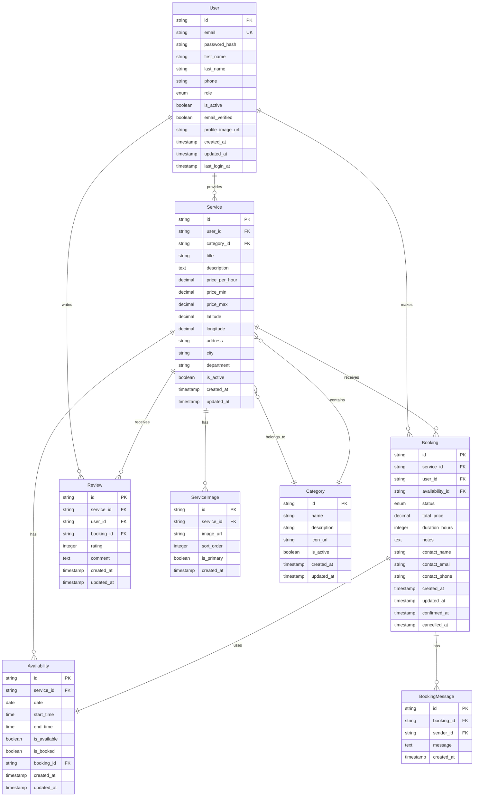

# Database Design - AgroRedUy

## 🗄️ Database Architecture

### Technology Stack
- **Database**: PostgreSQL 15+
- **ORM**: Prisma 5.x
- **Migration Tool**: Prisma Migrate
- **Connection Pooling**: PgBouncer (production)
- **Backup**: Automated daily backups
- **Monitoring**: Database performance monitoring

### Design Principles
- **Normalization**: 3NF compliance for data integrity
- **Performance**: Optimized indexes for common queries
- **Scalability**: Horizontal scaling considerations
- **Security**: Row-level security (RLS) where applicable
- **Backup**: Comprehensive backup strategy

## 📊 Entity Relationship Diagram



## 🏗️ Database Schema

### Users Table
```sql
CREATE TABLE users (
    id UUID PRIMARY KEY DEFAULT gen_random_uuid(),
    email VARCHAR(255) UNIQUE NOT NULL,
    password_hash VARCHAR(255) NOT NULL,
    first_name VARCHAR(100) NOT NULL,
    last_name VARCHAR(100) NOT NULL,
    phone VARCHAR(20),
    role user_role NOT NULL DEFAULT 'user',
    is_active BOOLEAN NOT NULL DEFAULT true,
    email_verified BOOLEAN NOT NULL DEFAULT false,
    profile_image_url TEXT,
    created_at TIMESTAMP WITH TIME ZONE NOT NULL DEFAULT NOW(),
    updated_at TIMESTAMP WITH TIME ZONE NOT NULL DEFAULT NOW(),
    last_login_at TIMESTAMP WITH TIME ZONE
);

CREATE TYPE user_role AS ENUM ('user', 'admin', 'superadmin');
```

### Services Table
```sql
CREATE TABLE services (
    id UUID PRIMARY KEY DEFAULT gen_random_uuid(),
    user_id UUID NOT NULL REFERENCES users(id) ON DELETE CASCADE,
    category_id UUID NOT NULL REFERENCES categories(id) ON DELETE RESTRICT,
    title VARCHAR(200) NOT NULL,
    description TEXT NOT NULL,
    price_per_hour DECIMAL(10,2) NOT NULL,
    price_min DECIMAL(10,2),
    price_max DECIMAL(10,2),
    latitude DECIMAL(10,8) NOT NULL,
    longitude DECIMAL(11,8) NOT NULL,
    address TEXT NOT NULL,
    city VARCHAR(100) NOT NULL,
    department VARCHAR(100) NOT NULL,
    is_active BOOLEAN NOT NULL DEFAULT true,
    created_at TIMESTAMP WITH TIME ZONE NOT NULL DEFAULT NOW(),
    updated_at TIMESTAMP WITH TIME ZONE NOT NULL DEFAULT NOW()
);
```

### Availability Table
```sql
CREATE TABLE availability (
    id UUID PRIMARY KEY DEFAULT gen_random_uuid(),
    service_id UUID NOT NULL REFERENCES services(id) ON DELETE CASCADE,
    date DATE NOT NULL,
    start_time TIME NOT NULL,
    end_time TIME NOT NULL,
    is_available BOOLEAN NOT NULL DEFAULT true,
    is_booked BOOLEAN NOT NULL DEFAULT false,
    booking_id UUID REFERENCES bookings(id) ON DELETE SET NULL,
    created_at TIMESTAMP WITH TIME ZONE NOT NULL DEFAULT NOW(),
    updated_at TIMESTAMP WITH TIME ZONE NOT NULL DEFAULT NOW(),
    
    CONSTRAINT availability_time_check CHECK (end_time > start_time),
    CONSTRAINT availability_unique_slot UNIQUE (service_id, date, start_time, end_time)
);
```

### Bookings Table
```sql
CREATE TABLE bookings (
    id UUID PRIMARY KEY DEFAULT gen_random_uuid(),
    service_id UUID NOT NULL REFERENCES services(id) ON DELETE CASCADE,
    user_id UUID NOT NULL REFERENCES users(id) ON DELETE CASCADE,
    availability_id UUID NOT NULL REFERENCES availability(id) ON DELETE CASCADE,
    status booking_status NOT NULL DEFAULT 'pending',
    total_price DECIMAL(10,2) NOT NULL,
    duration_hours INTEGER NOT NULL,
    notes TEXT,
    contact_name VARCHAR(200) NOT NULL,
    contact_email VARCHAR(255) NOT NULL,
    contact_phone VARCHAR(20) NOT NULL,
    created_at TIMESTAMP WITH TIME ZONE NOT NULL DEFAULT NOW(),
    updated_at TIMESTAMP WITH TIME ZONE NOT NULL DEFAULT NOW(),
    confirmed_at TIMESTAMP WITH TIME ZONE,
    cancelled_at TIMESTAMP WITH TIME ZONE
);

CREATE TYPE booking_status AS ENUM ('pending', 'confirmed', 'cancelled', 'completed');
```

### Categories Table
```sql
CREATE TABLE categories (
    id UUID PRIMARY KEY DEFAULT gen_random_uuid(),
    name VARCHAR(100) NOT NULL UNIQUE,
    description TEXT,
    icon_url TEXT,
    is_active BOOLEAN NOT NULL DEFAULT true,
    created_at TIMESTAMP WITH TIME ZONE NOT NULL DEFAULT NOW(),
    updated_at TIMESTAMP WITH TIME ZONE NOT NULL DEFAULT NOW()
);
```

### Service Images Table
```sql
CREATE TABLE service_images (
    id UUID PRIMARY KEY DEFAULT gen_random_uuid(),
    service_id UUID NOT NULL REFERENCES services(id) ON DELETE CASCADE,
    image_url TEXT NOT NULL,
    sort_order INTEGER NOT NULL DEFAULT 0,
    is_primary BOOLEAN NOT NULL DEFAULT false,
    created_at TIMESTAMP WITH TIME ZONE NOT NULL DEFAULT NOW()
);
```

### Reviews Table
```sql
CREATE TABLE reviews (
    id UUID PRIMARY KEY DEFAULT gen_random_uuid(),
    service_id UUID NOT NULL REFERENCES services(id) ON DELETE CASCADE,
    user_id UUID NOT NULL REFERENCES users(id) ON DELETE CASCADE,
    booking_id UUID NOT NULL REFERENCES bookings(id) ON DELETE CASCADE,
    rating INTEGER NOT NULL CHECK (rating >= 1 AND rating <= 5),
    comment TEXT,
    created_at TIMESTAMP WITH TIME ZONE NOT NULL DEFAULT NOW(),
    updated_at TIMESTAMP WITH TIME ZONE NOT NULL DEFAULT NOW(),
    
    CONSTRAINT review_unique_booking UNIQUE (booking_id)
);
```

### Booking Messages Table
```sql
CREATE TABLE booking_messages (
    id UUID PRIMARY KEY DEFAULT gen_random_uuid(),
    booking_id UUID NOT NULL REFERENCES bookings(id) ON DELETE CASCADE,
    sender_id UUID NOT NULL REFERENCES users(id) ON DELETE CASCADE,
    message TEXT NOT NULL,
    created_at TIMESTAMP WITH TIME ZONE NOT NULL DEFAULT NOW()
);
```

### Content Management Tables
```sql
-- FAQ Content
CREATE TABLE faq_content (
    id UUID PRIMARY KEY DEFAULT gen_random_uuid(),
    question TEXT NOT NULL,
    answer TEXT NOT NULL,
    sort_order INTEGER NOT NULL DEFAULT 0,
    is_active BOOLEAN NOT NULL DEFAULT true,
    created_at TIMESTAMP WITH TIME ZONE NOT NULL DEFAULT NOW(),
    updated_at TIMESTAMP WITH TIME ZONE NOT NULL DEFAULT NOW()
);

-- Terms and Conditions
CREATE TABLE terms_content (
    id UUID PRIMARY KEY DEFAULT gen_random_uuid(),
    title VARCHAR(200) NOT NULL,
    content TEXT NOT NULL,
    version VARCHAR(20) NOT NULL,
    is_active BOOLEAN NOT NULL DEFAULT true,
    created_at TIMESTAMP WITH TIME ZONE NOT NULL DEFAULT NOW(),
    updated_at TIMESTAMP WITH TIME ZONE NOT NULL DEFAULT NOW()
);

-- Privacy Policy
CREATE TABLE privacy_content (
    id UUID PRIMARY KEY DEFAULT gen_random_uuid(),
    title VARCHAR(200) NOT NULL,
    content TEXT NOT NULL,
    version VARCHAR(20) NOT NULL,
    is_active BOOLEAN NOT NULL DEFAULT true,
    created_at TIMESTAMP WITH TIME ZONE NOT NULL DEFAULT NOW(),
    updated_at TIMESTAMP WITH TIME ZONE NOT NULL DEFAULT NOW()
);

-- Contact Information
CREATE TABLE contact_info (
    id UUID PRIMARY KEY DEFAULT gen_random_uuid(),
    title VARCHAR(200) NOT NULL,
    content TEXT NOT NULL,
    contact_type VARCHAR(50) NOT NULL,
    is_active BOOLEAN NOT NULL DEFAULT true,
    created_at TIMESTAMP WITH TIME ZONE NOT NULL DEFAULT NOW(),
    updated_at TIMESTAMP WITH TIME ZONE NOT NULL DEFAULT NOW()
);
```

## 🔍 Database Indexes

### Performance Optimization Indexes
```sql
-- User indexes
CREATE INDEX idx_users_email ON users(email);
CREATE INDEX idx_users_role ON users(role);
CREATE INDEX idx_users_active ON users(is_active);

-- Service indexes
CREATE INDEX idx_services_user_id ON services(user_id);
CREATE INDEX idx_services_category_id ON services(category_id);
CREATE INDEX idx_services_active ON services(is_active);
CREATE INDEX idx_services_price ON services(price_per_hour);
CREATE INDEX idx_services_location ON services USING GIST (ST_Point(longitude, latitude));

-- Availability indexes
CREATE INDEX idx_availability_service_id ON availability(service_id);
CREATE INDEX idx_availability_date ON availability(date);
CREATE INDEX idx_availability_available ON availability(is_available);
CREATE INDEX idx_availability_booked ON availability(is_booked);

-- Booking indexes
CREATE INDEX idx_bookings_service_id ON bookings(service_id);
CREATE INDEX idx_bookings_user_id ON bookings(user_id);
CREATE INDEX idx_bookings_status ON bookings(status);
CREATE INDEX idx_bookings_created_at ON bookings(created_at);

-- Review indexes
CREATE INDEX idx_reviews_service_id ON reviews(service_id);
CREATE INDEX idx_reviews_user_id ON reviews(user_id);
CREATE INDEX idx_reviews_rating ON reviews(rating);

-- Message indexes
CREATE INDEX idx_booking_messages_booking_id ON booking_messages(booking_id);
CREATE INDEX idx_booking_messages_sender_id ON booking_messages(sender_id);
CREATE INDEX idx_booking_messages_created_at ON booking_messages(created_at);
```

### Geographic Search Indexes
```sql
-- PostGIS extension for geographic queries
CREATE EXTENSION IF NOT EXISTS postgis;

-- Spatial index for location-based searches
CREATE INDEX idx_services_geog ON services USING GIST (
    ST_Point(longitude, latitude)::geography
);

-- Distance-based search function
CREATE OR REPLACE FUNCTION find_services_nearby(
    lat DECIMAL(10,8),
    lng DECIMAL(11,8),
    radius_km INTEGER DEFAULT 10
)
RETURNS TABLE (
    service_id UUID,
    distance_km DECIMAL
) AS $$
BEGIN
    RETURN QUERY
    SELECT 
        s.id,
        ST_Distance(
            ST_Point(s.longitude, s.latitude)::geography,
            ST_Point(lng, lat)::geography
        ) / 1000 AS distance_km
    FROM services s
    WHERE ST_DWithin(
        ST_Point(s.longitude, s.latitude)::geography,
        ST_Point(lng, lat)::geography,
        radius_km * 1000
    )
    AND s.is_active = true
    ORDER BY distance_km;
END;
$$ LANGUAGE plpgsql;
```

## 🔒 Security Implementation

### Row Level Security (RLS)
```sql
-- Enable RLS on sensitive tables
ALTER TABLE users ENABLE ROW LEVEL SECURITY;
ALTER TABLE services ENABLE ROW LEVEL SECURITY;
ALTER TABLE bookings ENABLE ROW LEVEL SECURITY;

-- Users can only see their own data
CREATE POLICY user_own_data ON users
    FOR ALL TO authenticated
    USING (id = current_user_id());

-- Users can only manage their own services
CREATE POLICY user_own_services ON services
    FOR ALL TO authenticated
    USING (user_id = current_user_id());

-- Users can only see their own bookings
CREATE POLICY user_own_bookings ON bookings
    FOR ALL TO authenticated
    USING (user_id = current_user_id());

-- Admins can see all data
CREATE POLICY admin_all_data ON users
    FOR ALL TO admin_role
    USING (true);

CREATE POLICY admin_all_services ON services
    FOR ALL TO admin_role
    USING (true);

CREATE POLICY admin_all_bookings ON bookings
    FOR ALL TO admin_role
    USING (true);
```

### Data Encryption
```sql
-- Encrypt sensitive data
CREATE EXTENSION IF NOT EXISTS pgcrypto;

-- Function to encrypt phone numbers
CREATE OR REPLACE FUNCTION encrypt_phone(phone VARCHAR(20))
RETURNS TEXT AS $$
BEGIN
    RETURN encode(pgp_sym_encrypt(phone, current_setting('app.encryption_key')), 'base64');
END;
$$ LANGUAGE plpgsql;

-- Function to decrypt phone numbers
CREATE OR REPLACE FUNCTION decrypt_phone(encrypted_phone TEXT)
RETURNS VARCHAR(20) AS $$
BEGIN
    RETURN pgp_sym_decrypt(decode(encrypted_phone, 'base64'), current_setting('app.encryption_key'));
END;
$$ LANGUAGE plpgsql;
```

## 📊 Database Functions

### Geographic Functions
```sql
-- Calculate distance between two points
CREATE OR REPLACE FUNCTION calculate_distance(
    lat1 DECIMAL(10,8),
    lng1 DECIMAL(11,8),
    lat2 DECIMAL(10,8),
    lng2 DECIMAL(11,8)
)
RETURNS DECIMAL AS $$
BEGIN
    RETURN ST_Distance(
        ST_Point(lng1, lat1)::geography,
        ST_Point(lng2, lat2)::geography
    ) / 1000; -- Return distance in kilometers
END;
$$ LANGUAGE plpgsql;

-- Find services within radius
CREATE OR REPLACE FUNCTION services_within_radius(
    center_lat DECIMAL(10,8),
    center_lng DECIMAL(11,8),
    radius_km INTEGER
)
RETURNS TABLE (
    service_id UUID,
    title VARCHAR(200),
    distance_km DECIMAL
) AS $$
BEGIN
    RETURN QUERY
    SELECT 
        s.id,
        s.title,
        calculate_distance(center_lat, center_lng, s.latitude, s.longitude) AS distance_km
    FROM services s
    WHERE calculate_distance(center_lat, center_lng, s.latitude, s.longitude) <= radius_km
    AND s.is_active = true
    ORDER BY distance_km;
END;
$$ LANGUAGE plpgsql;
```

### Business Logic Functions
```sql
-- Check if service is available on specific date
CREATE OR REPLACE FUNCTION is_service_available(
    service_uuid UUID,
    check_date DATE,
    start_time TIME,
    end_time TIME
)
RETURNS BOOLEAN AS $$
DECLARE
    available_count INTEGER;
BEGIN
    SELECT COUNT(*)
    INTO available_count
    FROM availability a
    WHERE a.service_id = service_uuid
    AND a.date = check_date
    AND a.start_time <= start_time
    AND a.end_time >= end_time
    AND a.is_available = true
    AND a.is_booked = false;
    
    RETURN available_count > 0;
END;
$$ LANGUAGE plpgsql;

-- Calculate booking total price
CREATE OR REPLACE FUNCTION calculate_booking_price(
    service_uuid UUID,
    duration_hours INTEGER
)
RETURNS DECIMAL(10,2) AS $$
DECLARE
    hourly_rate DECIMAL(10,2);
BEGIN
    SELECT price_per_hour
    INTO hourly_rate
    FROM services
    WHERE id = service_uuid;
    
    RETURN hourly_rate * duration_hours;
END;
$$ LANGUAGE plpgsql;
```

## 🔄 Database Triggers

### Automatic Timestamps
```sql
-- Update updated_at timestamp
CREATE OR REPLACE FUNCTION update_updated_at_column()
RETURNS TRIGGER AS $$
BEGIN
    NEW.updated_at = NOW();
    RETURN NEW;
END;
$$ LANGUAGE plpgsql;

-- Apply to all tables with updated_at column
CREATE TRIGGER update_users_updated_at
    BEFORE UPDATE ON users
    FOR EACH ROW EXECUTE FUNCTION update_updated_at_column();

CREATE TRIGGER update_services_updated_at
    BEFORE UPDATE ON services
    FOR EACH ROW EXECUTE FUNCTION update_updated_at_column();

CREATE TRIGGER update_bookings_updated_at
    BEFORE UPDATE ON bookings
    FOR EACH ROW EXECUTE FUNCTION update_updated_at_column();
```

### Business Logic Triggers
```sql
-- Update availability when booking is created
CREATE OR REPLACE FUNCTION update_availability_on_booking()
RETURNS TRIGGER AS $$
BEGIN
    UPDATE availability
    SET is_booked = true, booking_id = NEW.id
    WHERE id = NEW.availability_id;
    
    RETURN NEW;
END;
$$ LANGUAGE plpgsql;

CREATE TRIGGER booking_created_trigger
    AFTER INSERT ON bookings
    FOR EACH ROW EXECUTE FUNCTION update_availability_on_booking();

-- Update availability when booking is cancelled
CREATE OR REPLACE FUNCTION update_availability_on_cancellation()
RETURNS TRIGGER AS $$
BEGIN
    IF OLD.status != 'cancelled' AND NEW.status = 'cancelled' THEN
        UPDATE availability
        SET is_booked = false, booking_id = NULL
        WHERE id = OLD.availability_id;
    END IF;
    
    RETURN NEW;
END;
$$ LANGUAGE plpgsql;

CREATE TRIGGER booking_cancelled_trigger
    AFTER UPDATE ON bookings
    FOR EACH ROW EXECUTE FUNCTION update_availability_on_cancellation();
```

## 📈 Performance Monitoring

### Query Performance Views
```sql
-- Slow queries monitoring
CREATE VIEW slow_queries AS
SELECT 
    query,
    calls,
    total_time,
    mean_time,
    rows
FROM pg_stat_statements
WHERE mean_time > 1000 -- queries taking more than 1 second
ORDER BY mean_time DESC;

-- Table size monitoring
CREATE VIEW table_sizes AS
SELECT 
    schemaname,
    tablename,
    pg_size_pretty(pg_total_relation_size(schemaname||'.'||tablename)) AS size
FROM pg_tables
WHERE schemaname = 'public'
ORDER BY pg_total_relation_size(schemaname||'.'||tablename) DESC;

-- Index usage monitoring
CREATE VIEW index_usage AS
SELECT 
    schemaname,
    tablename,
    indexname,
    idx_tup_read,
    idx_tup_fetch
FROM pg_stat_user_indexes
ORDER BY idx_tup_read DESC;
```

## 🔄 Migration Strategy

### Prisma Schema
```prisma
// schema.prisma
generator client {
  provider = "prisma-client-js"
}

datasource db {
  provider = "postgresql"
  url      = env("DATABASE_URL")
}

model User {
  id            String    @id @default(uuid())
  email         String    @unique
  passwordHash  String    @map("password_hash")
  firstName     String    @map("first_name")
  lastName      String    @map("last_name")
  phone         String?
  role          UserRole  @default(USER)
  isActive      Boolean   @default(true) @map("is_active")
  emailVerified Boolean   @default(false) @map("email_verified")
  profileImageUrl String? @map("profile_image_url")
  createdAt     DateTime  @default(now()) @map("created_at")
  updatedAt     DateTime  @updatedAt @map("updated_at")
  lastLoginAt   DateTime? @map("last_login_at")
  
  services      Service[]
  bookings      Booking[]
  reviews       Review[]
  sentMessages  BookingMessage[] @relation("MessageSender")
  
  @@map("users")
}

model Service {
  id          String   @id @default(uuid())
  userId      String   @map("user_id")
  categoryId  String   @map("category_id")
  title       String
  description String
  pricePerHour Decimal @map("price_per_hour")
  priceMin    Decimal? @map("price_min")
  priceMax    Decimal? @map("price_max")
  latitude    Decimal
  longitude   Decimal
  address     String
  city        String
  department  String
  isActive    Boolean  @default(true) @map("is_active")
  createdAt   DateTime @default(now()) @map("created_at")
  updatedAt   DateTime @updatedAt @map("updated_at")
  
  user        User           @relation(fields: [userId], references: [id], onDelete: Cascade)
  category    Category       @relation(fields: [categoryId], references: [id], onDelete: Restrict)
  availability Availability[]
  bookings    Booking[]
  images      ServiceImage[]
  reviews     Review[]
  
  @@map("services")
}

enum UserRole {
  USER
  ADMIN
  SUPERADMIN
}

enum BookingStatus {
  PENDING
  CONFIRMED
  CANCELLED
  COMPLETED
}
```

### Migration Commands
```bash
# Generate migration
npx prisma migrate dev --name init

# Apply migrations
npx prisma migrate deploy

# Reset database
npx prisma migrate reset

# Generate Prisma client
npx prisma generate
```

## 🔄 Backup Strategy

### Automated Backups
```bash
#!/bin/bash
# backup.sh

# Create backup directory
mkdir -p /backups/agrored

# Create timestamp
TIMESTAMP=$(date +%Y%m%d_%H%M%S)

# Create database backup
pg_dump -h localhost -U agrored_user -d agrored_db > /backups/agrored/backup_$TIMESTAMP.sql

# Compress backup
gzip /backups/agrored/backup_$TIMESTAMP.sql

# Keep only last 30 days of backups
find /backups/agrored -name "backup_*.sql.gz" -mtime +30 -delete

# Upload to cloud storage (optional)
aws s3 cp /backups/agrored/backup_$TIMESTAMP.sql.gz s3://agrored-backups/
```

### Recovery Procedures
```bash
# Restore from backup
gunzip -c backup_20241201_120000.sql.gz | psql -h localhost -U agrored_user -d agrored_db

# Point-in-time recovery
pg_basebackup -h localhost -U agrored_user -D /restore/agrored -Ft -z -P
```

---

**Last Updated**: December 2024  
**Version**: 1.0  
**Maintainer**: Development Team
